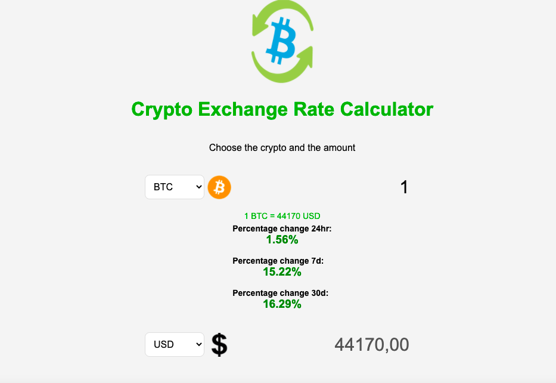

# API 
To make this simple application I used the coingecko API, to take a look at the documentation:
https://www.coingecko.com/en/api/documentation

# Appereance

# Information on how it works
Once the application is open, you can select the crypto and the desired quantity in the first selection, and you can see the respective value in the second selection.  

In the first selection you can choose between: 
**BTC, USDT, ETH, BNB, DOGE, LTC, MANA, VET**   

in the second selection you can choose between: 
**BTC, USD, ETH, BNB, LTC, EUR**
